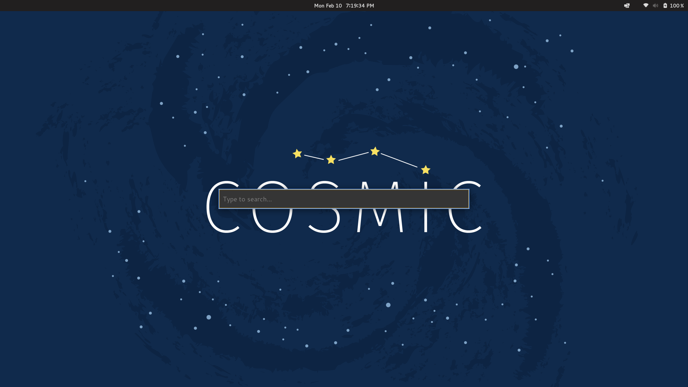
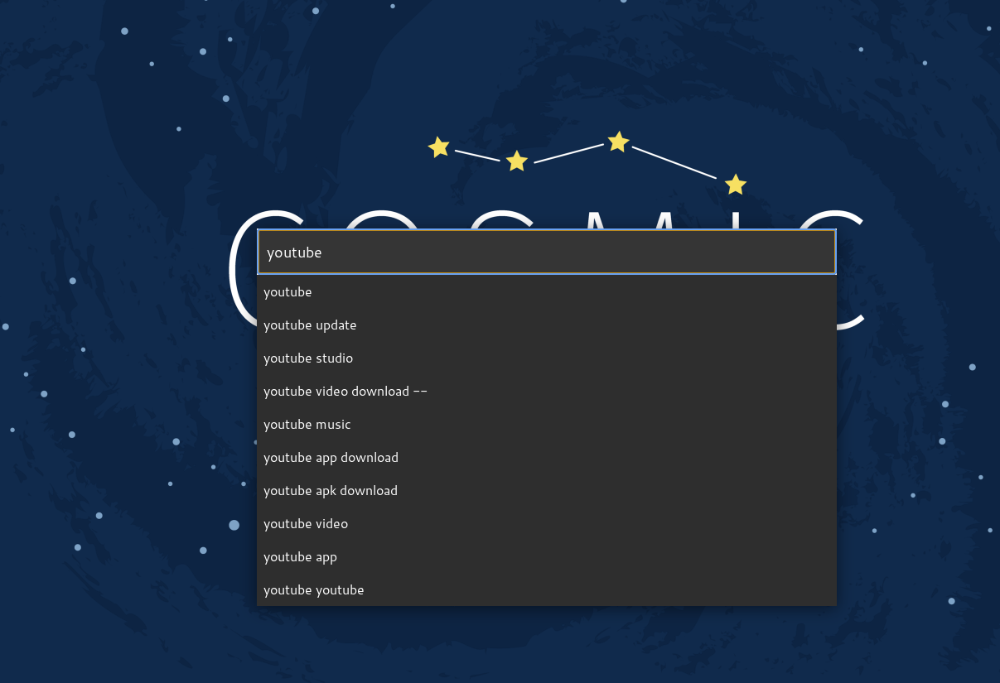
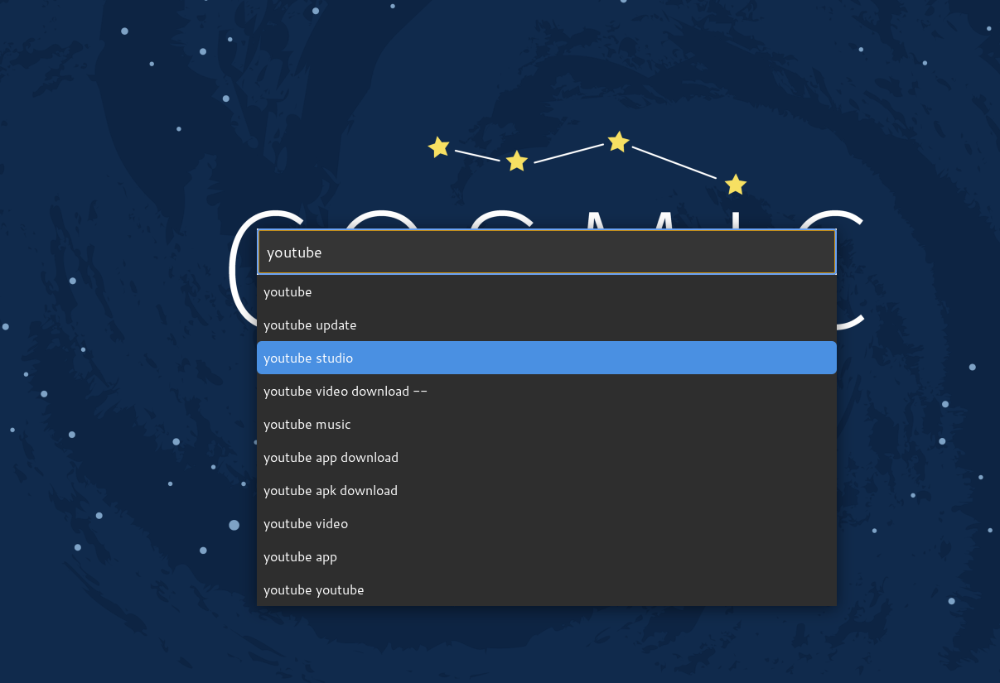
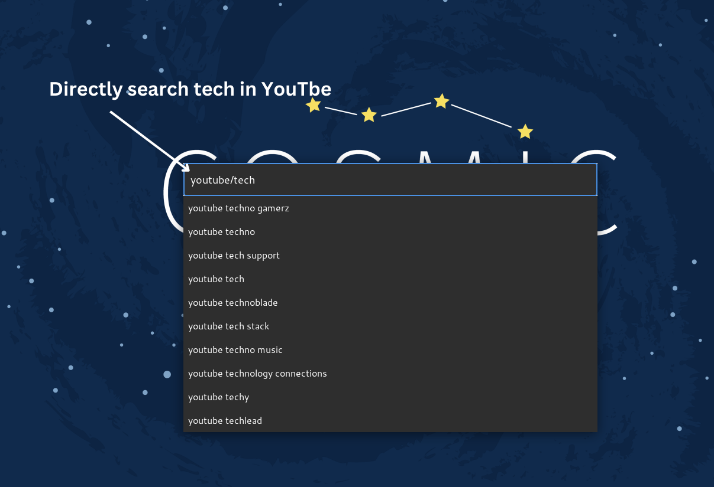

# SearchBar - A Simple GTK3 Search Bar with Google Autocomplete

## Overview
SearchBar is a lightweight, modern search bar built with Python and GTK3 that provides Google search suggestions in real-time. It allows users to quickly search Google or specific websites using a simple query format.

## Features
- Minimalist and elegant UI
- Google autocomplete suggestions
- Keyboard navigation (Arrow keys, Tab, and Enter)
- Supports direct website searches (e.g., `youtube/tech` searches "tech" on YouTube, `stackoverflow/python error` searches Stack Overflow for "python error")
- Opens URLs directly if entered
- Smart site-based search for platforms like:
  - `youtube/query` → Searches YouTube
  - `github/query` → Searches GitHub
  - `reddit/query` → Searches Reddit
  - `amazon/query` → Searches Amazon
  - `flipkart/query` → Searches Flipkart
  - `wikipedia/query` → Searches Wikipedia
  - `stackoverflow/query` → Searches Stack Overflow
- Opens search results in the default web browser
- Supports shortcut key binding for quick access


### You can add More Website in line 213 depending upon your requirement


## Installation

### Dependencies
Ensure you have the following dependencies installed:

#### Linux (Ubuntu/Debian-based)
```sh
sudo apt update
sudo apt install python3 python3-gi python3-gi-cairo gir1.2-gtk-3.0
pip install requests
```

### To make shortcut one simple step is download the launch_search_bar.sh and directly map this with the favaourable Keys

#### Windows
1. Install [MSYS2](https://www.msys2.org/) and run:
   ```sh
   pacman -S mingw-w64-x86_64-python-gobject mingw-w64-x86_64-gtk3
   ```
2. Install Python dependencies:
   ```sh
   pip install requests
   ```

## Running the Application

Run the script with:
```sh
python3 search_bar.py
```

## Setting Up a Keyboard Shortcut
To make SearchBar easily accessible, you can bind it to `Super+S` (Windows Key + S) on your system.

### Linux (GNOME)
1. Open **Settings** → **Keyboard Shortcuts**
2. Click **"+" (Add Shortcut)**
3. Name: `SearchBar`
4. Command: `/usr/bin/python3 /path/to/search_bar.py`
5. Set Shortcut: **Super+S**

### Windows (AutoHotkey)
1. Install [AutoHotkey](https://www.autohotkey.com/)
2. Create a new script with the following content:
   ```ahk
   #s::
   Run, pythonw "C:\path\to\search_bar.py"
   return
   ```
3. Save and run the script.

## Screenshots





## License
This project is licensed under the MIT License.

---
Enjoy fast searching with SearchBar! 🚀

